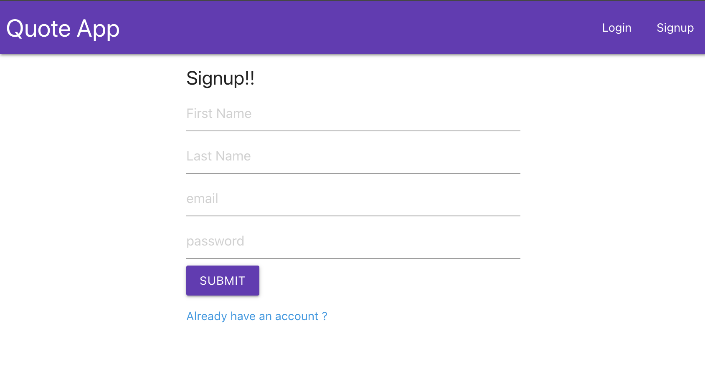
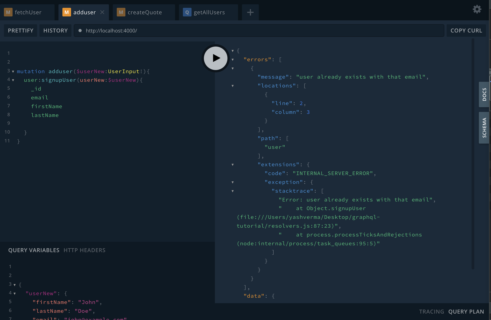
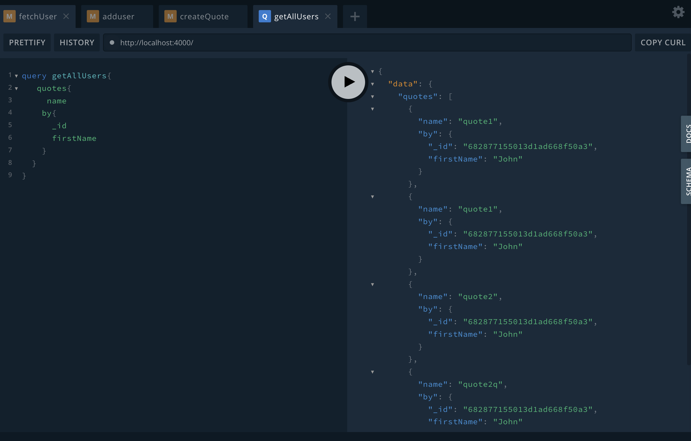
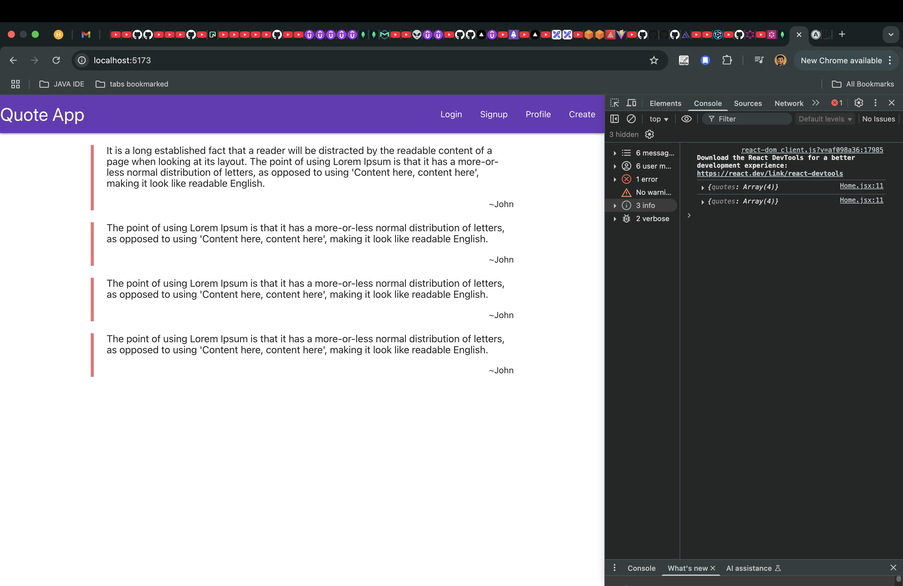
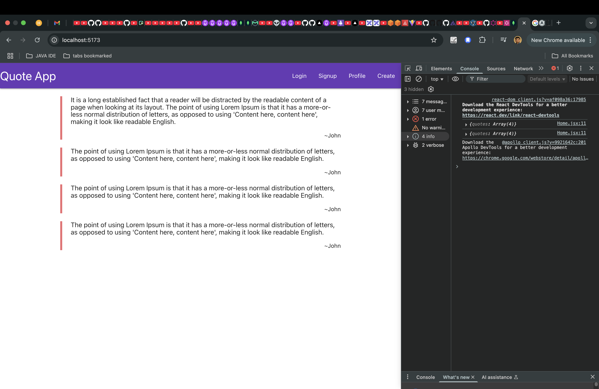

# Quote App 📝

A modern, full-stack quote sharing application built with React, GraphQL,Node and MongoDB. Share your favorite quotes, discover others' thoughts, and connect with fellow quote enthusiasts.



## ✨ Features

- 🔐 User Authentication (Signup/Login)
- 📝 Create and share quotes
- 👥 View quotes from all users
- 👤 User profiles with personal quotes
- 🔄 Real-time updates with GraphQL
- 🎨 Modern and responsive UI
- 🔒 Secure password handling
- 🚀 Fast and efficient data fetching

## 🛠️ Tech Stack

- **Frontend:**
  - React
  - Apollo Client
  - React Router
  - Materialize CSS

- **Backend:**
  - Node.js
  - GraphQL
  - Apollo Server
  - MongoDB
  - JWT Authentication

## 🚀 Getting Started

### Prerequisites

- Node.js (v14 or higher)
- MongoDB
- npm or yarn

### Installation

1. Clone the repository:
   ```bash
   git clone https://github.com/yourusername/quote-app.git
   cd quote-app
   ```

2. Install server dependencies:
   ```bash
   npm install
   ```

3. Install client dependencies:
   ```bash
   cd my-react-app
   npm install
   ```

4. Create a `.env` file in the root directory with your MongoDB URI and JWT secret:
   ```
   MONGO_URI=your_mongodb_uri
   JWT_SECRET=your_jwt_secret
   ```

### Running the Application

1. Start the server:
   ```bash
   node server.js
   ```

2. In a new terminal, start the client:
   ```bash
   cd my-react-app
   npm run dev
   ```

3. Open your browser and navigate to `http://localhost:5173`

## 📸 Screenshots

### Home Page


### Create Quote


### User Profile


### Authentication


## 🔑 Key Features in Detail

### User Authentication
- Secure signup and login system
- JWT-based authentication
- Protected routes for authenticated users

### Quote Management
- Create new quotes
- View all quotes
- Real-time updates when new quotes are added
- User attribution for each quote

### Profile System
- Personal profile page
- View your own quotes
- Profile customization

## 🤝 Contributing

Contributions are welcome! Please feel free to submit a Pull Request.

## 📝 License

This project is licensed under the MIT License - see the LICENSE file for details.

## 👥 Authors

- Your Name - Yash Verma

## 🙏 Acknowledgments

- Materialize CSS for the beautiful UI components
- Apollo GraphQL for the amazing GraphQL client and server
- MongoDB for the robust database solution
